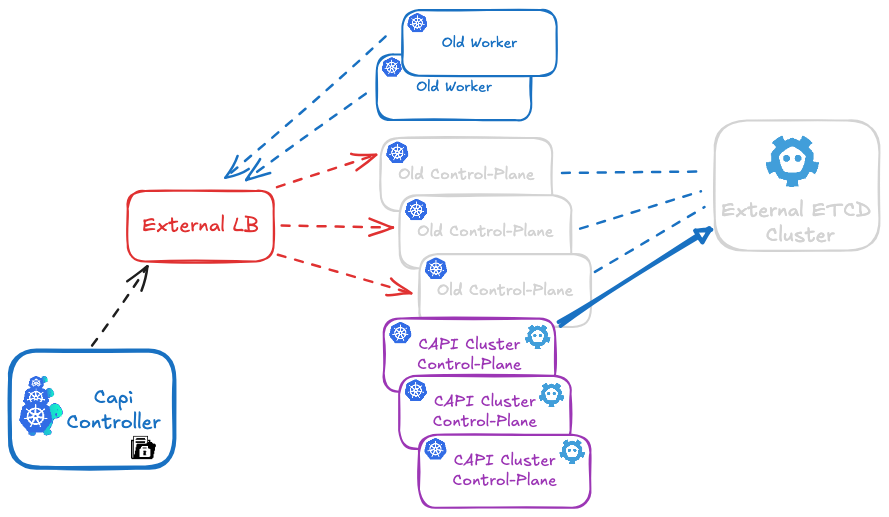

# Migrating from External to Internal etcd with Cluster API

*Automating etcd migration for CAPI Kubernetes clusters*

**By Jean-François Pucheu**

---



## Introduction

In my [previous article on CAPI migration](https://devops-notes.com/capi/migrate-cluster.html), I presented a procedure for migrating a kubeadm Kubernetes cluster to Cluster API.

This article presents an automated script that enables migrating a legacy Kubernetes cluster directly to Cluster API with internal (stacked) etcd, in **two scenarios**:

1. **Legacy cluster with external etcd**: Migration from external etcd to internal CAPI etcd
2. **Legacy cluster with internal etcd**: Migration from a classic kubeadm cluster (with etcd already in stacked mode) to CAPI while preserving etcd data

The `etcd_migration.sh` script is available on [GitHub](https://github.com/jfpucheu/cluster-api-lab/blob/main/etcd_migration.sh) and automates the migration process for the **first CAPI control plane**. Once this first control plane is migrated, CAPI automatically handles adding subsequent control planes with their local etcd.

## Why This Migration?

### The CAPI Standard Approach: Stacked etcd

In a standard Cluster API architecture, etcd is deployed locally on each control plane node in stacked mode. This configuration offers several advantages:

- **Simplicity**: No external infrastructure to manage, everything is integrated into the control planes
- **Native high availability**: The etcd cluster automatically follows control plane scaling
- **Optimal performance**: Minimal latency (localhost) between the API server and etcd
- **Cost reduction**: No dedicated servers for etcd
- **Automated management**: kubeadm manages the entire etcd lifecycle

## Script Architecture

### How It Works

The `etcd_migration.sh` script implements a **progressive migration strategy by adding a new member**. This approach allows adding the **first control plane with local etcd** to the existing etcd cluster (whether external or internal to the legacy cluster).

**Crucial point**: The script applies **only to the first control plane**. Once this first control plane is successfully migrated, **CAPI automatically handles adding subsequent control planes** to the etcd cluster, according to the `KubeadmControlPlane` configuration.

### Two Migration Scenarios

#### Scenario 1: Legacy Cluster with External etcd

You have a kubeadm cluster with etcd deployed on separate servers:
- 3 external etcd servers (for example: etcd-01, etcd-02, etcd-03)
- 3 kubeadm control planes connecting to this external etcd
- N workers

**Migration**: The script migrates data from external etcd to the new local etcd of the first CAPI control plane.

#### Scenario 2: Legacy Cluster with Internal etcd (Stacked)

You have a classic kubeadm cluster with etcd already in stacked mode:
- 3 kubeadm control planes, each with its local etcd
- N workers

**Migration**: The script migrates data from legacy etcd (already internal) to the new local etcd of the first CAPI control plane. In this case, the "external etcd" mentioned in commands are actually the IP addresses of legacy control planes where etcd runs.

**In both cases**, the result is identical: a CAPI cluster with local etcd on each control plane.

### Script Phases

The script is divided into two distinct phases that must be executed on the first control plane only:

1. **prekubeadm**: Preparation and addition of the new member to the existing etcd cluster
2. **postkubeadm**: Synchronization, leadership transfer, and cleanup of old members

## Workflow: Legacy → CAPI Migration with Internal etcd

This workflow shows how to migrate directly from a legacy cluster to CAPI with internal etcd. The procedure is identical whether your legacy cluster has external or internal etcd.

### Step 0: Initial State

**Scenario 1 - external etcd**:
- Legacy cluster with kubeadm
- External etcd (3 separate nodes)
- Legacy control planes (3 nodes)
- Legacy workers (N nodes)

**Scenario 2 - legacy internal etcd**:
- Legacy cluster with kubeadm
- Local etcd on each control plane (legacy stacked mode)
- Legacy control planes (3 nodes with integrated etcd)
- Legacy workers (N nodes)

### Step 1: CAPI Migration Preparation

Using `prepare_secrets.sh` to prepare secrets:
```bash
# On a legacy control plane
./prepare_secrets.sh my-cluster
```

### Step 2: Creating CAPI Cluster with etcd Migration

**KubeadmControlPlane configuration** to include the migration script:

```yaml
apiVersion: controlplane.cluster.x-k8s.io/v1beta1
kind: KubeadmControlPlane
metadata:
  name: my-cluster-control-plane
spec:
  replicas: 3
  kubeadmConfigSpec:
    # The script must be present on the machines
    files:
    - path: /usr/local/bin/etcd_migration.sh
      permissions: '0755'
      content: |
        #!/bin/bash
        # Content of etcd_migration.sh script
        # (insert here the script content from GitHub)
    
    # Execution BEFORE kubeadm init
    # Scenario 1: External etcd server addresses
    # Scenario 2: Legacy control plane addresses (where etcd runs)
    preKubeadmCommands:
    - /usr/local/bin/etcd_migration.sh prekubeadm etcd-01:192.168.3.58 etcd-02:192.168.3.113 etcd-03:192.168.3.178
    
    # Execution AFTER kubeadm init
    postKubeadmCommands:
    - /usr/local/bin/etcd_migration.sh postkubeadm etcd-01:192.168.3.58 etcd-02:192.168.3.113 etcd-03:192.168.3.178
    
    initConfiguration:
      nodeRegistration:
        kubeletExtraArgs:
          # your kubelet configurations
    
    clusterConfiguration:
      # Standard CAPI configuration with local etcd
      etcd:
        local:
          dataDir: /var/lib/etcd
```

**What happens**:

1. CAPI creates the first control plane
2. The `etcd_migration.sh` script is copied to the machine via `files`
3. Before kubeadm executes, `preKubeadmCommands` launches the script in `prekubeadm` mode
   - The script connects to existing etcd (external or on legacy CPs)
   - It adds the new control plane as a member of the etcd cluster
4. kubeadm executes and initializes the control plane with local etcd
5. After kubeadm, `postKubeadmCommands` launches the script in `postkubeadm` mode
   - Data synchronization
   - Removal of old etcd members
6. The first control plane is now operational with migrated local etcd

**CAPI then automatically adds the 2 other control planes** according to your `KubeadmControlPlane` configuration (replicas: 3), each with its local etcd that synchronizes automatically.

Result:
- Complete CAPI cluster with 3 control planes
- Local (stacked) etcd on each control plane from the start
- Old external etcd servers (scenario 1) or legacy control planes (scenario 2) can be decommissioned

### Step 3: Decommissioning

1. Monitor the cluster for 7-14 days
2. Verify metrics and logs
3. Progressively shutdown:
   - **Scenario 1**: Legacy external etcd servers
   - **Scenario 2**: Legacy control planes (with their integrated etcd)
4. Keep backups for 30-90 days
5. Final resource release

## Script Phases

### Phase 1: prekubeadm

This phase must be executed **BEFORE** launching kubeadm on the new control plane.

**Main steps**:
1. Verification of `/run/kubeadm/kubeadm.yaml` file (generated by CAPI)
2. Generation of temporary client certificates
3. Local etcd installation
4. Building the `initial-cluster` string including all members
5. Adding the member to the existing etcd cluster
6. Modifying the kubeadm.yaml file with the configuration

**Result**: The external etcd cluster knows a new member will join, and the system is ready for kubeadm execution.

### Phase 2: postkubeadm

This phase must be executed **AFTER** kubeadm has created the new control plane.

**Main steps**:
1. Cleaning the kubeadm-config ConfigMap
2. Waiting for complete synchronization
3. Transferring leadership to the new node
4. Removing old external members
5. Final cluster verification

**Result**: The first control plane has a fully synchronized local etcd, and old external members are removed.

## Advantages of This Approach

For CAPI migrations:
- Direct migration to CAPI with internal etcd, without intermediate step with external etcd
- Immediately results in a CAPI cluster 100% compliant with best practices
- Executes on the first CAPI control plane, then CAPI automatically handles the rest
- **Risk reduction**: Progressive migration with validation at each level
- **Zero downtime**: The cluster remains operational throughout the migration
- **Easy rollback**: Ability to roll back if necessary
- **Incremental validation**: Testing and validation after each change
- **Simplicity**: No need to manage an intermediate step with external etcd

## Important Technical Details

### etcd Quorum Management

The script carefully maintains quorum at all times:
- **3-member cluster**: Quorum = 2, tolerates 1 failure
- **Adding a member**: 4-member cluster, quorum = 3, tolerates 1 failure
- **Removing a member**: Back to 3 members, quorum = 2

**Important**: Never remove multiple members simultaneously.

### Synchronization

Synchronization relies on comparing **revision numbers**. The revision is a monotonic counter that increases with each write operation. Two members with the same revision have exactly the same data.

### Leadership Transfer

Leadership transfer is important for:
1. **Performance**: Avoid request redirections during removal
2. **Stability**: Ensure the leader is on a node that won't be removed

## Conclusion

The `etcd_migration.sh` script provides an automated solution for migrating a legacy Kubernetes cluster directly to a CAPI cluster with local (stacked) etcd, **whether your legacy cluster uses external etcd or etcd already in stacked mode**.

**This migration ensures**:
- Direct migration to CAPI with internal etcd, without intermediate step
- Support for two scenarios: external etcd OR legacy internal etcd
- CAPI cluster 100% compliant with best practices from the start
- **Zero downtime** during migration
- **Data security** with validation at each step
- **Automation** of a complex and risky process
- **Modern architecture** with local etcd automatically managed by CAPI

The script is available on GitHub and enables a smooth transition from legacy to CAPI, regardless of your current etcd configuration.

### Resources

- [etcd_migration.sh script on GitHub](https://github.com/jfpucheu/cluster-api-lab/blob/main/etcd_migration.sh)
- [Article: Migration to CAPI](https://devops-notes.com/capi/migrate-cluster.html)
- [Cluster API Documentation](https://cluster-api.sigs.k8s.io/)
- [etcd Documentation](https://etcd.io/docs/)

---

*Feel free to contact me for any questions or improvement suggestions!*
