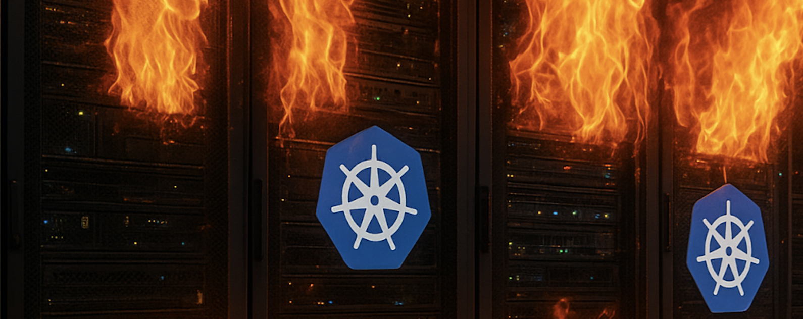

# Resurrect Your Broken Kubernetes Cluster with Just One ETCD Snapshot



*Reading time: 8 minutes | Last updated: November 30, 2025*

---

## 🎯 The Scenario

Your production Kubernetes cluster is **gone**. Complete datacenter failure. Every node destroyed. But you have one thing: **an ETCD backup from yesterday**.

In this article, I'll show you how to resurrect your entire cluster using **Cluster API (CAPI)** and that single ETCD snapshot. Everything — your deployments, secrets, configs, RBAC policies — all restored in **less than 30 minutes**.

### What You'll Learn

- ✅ Why ETCD is your ultimate insurance policy
- ✅ Restore a complete cluster using Cluster API automation
- ✅ Handle the critical kubeadm preflight checks
- ✅ **Don't forget the ETCD encryption key** (if enabled)
- ✅ Clean up old infrastructure properly
- ✅ The entire disaster recovery workflow

> **Universal Approach**: This works with any Kubernetes cluster — CAPI, kubeadm, EKS, AKS, GKE. The principles remain the same.

> ⚠️ **Critical Warning**: If your cluster uses ETCD encryption-at-rest, you MUST have a backup of the encryption key (`/etc/kubernetes/pki/encryption-config.yaml`). Without it, all your Secrets will be unreadable after restoration!

---

## 📚 Why ETCD is Your Lifeline

### The Single Source of Truth

ETCD isn't just a database — it's **the brain** of your Kubernetes cluster. Everything lives there:

- 🔐 All Secrets and ConfigMaps
- 📦 Every Deployment, Service, and Ingress
- 🎫 Certificates and authentication tokens
- 📊 Complete state of all Pods and Nodes
- 🔒 RBAC policies and ServiceAccounts
- 🎯 CustomResourceDefinitions and their instances

> **Critical Point**: With a recent ETCD backup, you can recreate your **entire cluster**, even if every node has vanished.

### The "Stateless Cluster" Paradigm

A **stateless cluster** means:

1. **Workloads are ephemeral**: Apps use external persistent storage (EBS, Ceph, NFS)
2. **Infrastructure is code**: Nodes are recreated via Terraform, CAPI, or cloud-init
3. **State lives in ETCD**: All cluster configuration exists in ETCD

This enables **ultra-fast disaster recovery**: destroy everything, restore ETCD, and your cluster rises from the ashes! 🔥

---

## 🔧 Prerequisites

```bash
# Required Tools
✓ kubectl (>= 1.28)
✓ clusterctl (Cluster API CLI)
✓ etcdctl (>= 3.4)
✓ curl or aws-cli (for fetching backups)

# Required Access
✓ Management CAPI cluster operational
✓ Recent ETCD backup (< 24h ideally)
✓ Access to backup storage (S3, GCS, HTTP, etc.)

# ⚠️ CRITICAL: ETCD Encryption Key
✓ Backup of ETCD encryption key (if encryption-at-rest enabled)
  Location: /etc/kubernetes/pki/etcd/encryption-config.yaml
  Without this key, your Secrets will be UNREADABLE!
```

### ⚠️ Critical: ETCD Encryption Key

If your cluster uses **encryption at rest** for Secrets, you **MUST** have a backup of the encryption key. Without it, all your Secrets will be encrypted garbage in the restored cluster.

**Check if encryption is enabled:**
```bash
# On existing control plane
kubectl get pod kube-apiserver-* -n kube-system -o yaml | grep encryption-provider-config

# If you see output, encryption is enabled
```

**Backup the encryption key:**
```bash
# The encryption configuration file
sudo cp /etc/kubernetes/pki/etcd/encryption-config.yaml /backup/

# Example content:
apiVersion: apiserver.config.k8s.io/v1
kind: EncryptionConfiguration
resources:
  - resources:
      - secrets
    providers:
      - aescbc:
          keys:
            - name: key1
              secret: <BASE64_ENCODED_KEY>  # ← THIS IS CRITICAL!
      - identity: {}
```

**Store it securely:**
```bash
# Encrypt and store with your ETCD backup
openssl enc -aes-256-cbc -salt -in encryption-config.yaml \
  -out encryption-config.yaml.enc -pass pass:your-secure-password

# Upload alongside ETCD backup
aws s3 cp encryption-config.yaml.enc s3://backups/
```

---

## 🚀 The Complete Restoration Workflow

### Architecture Overview

```
┌─────────────────────────────────────────────────────┐
│         Management Cluster (CAPI)                   │
│  ┌──────────────────────────────────────────────┐   │
│  │  clusterctl creates workload cluster         │   │
│  └──────────────────────────────────────────────┘   │
└─────────────────────────────────────────────────────┘
                         │
                         ↓
┌─────────────────────────────────────────────────────┐
│       New Workload Cluster (empty)                  │
│  ┌──────────────────────────────────────────────┐   │
│  │  1️⃣  Bootstrap control plane nodes            │  │
│  │  2️⃣  Inject restoration script                │  │
│  │  3️⃣  Restore ETCD BEFORE kubeadm init         │  │
│  │  4️⃣  Cluster restored with all resources      │  │
│  │  5️⃣  Clean up old workers & update LB         │  │
│  └──────────────────────────────────────────────┘   │
└─────────────────────────────────────────────────────┘
```

---

## 📝 Step 1: The Restoration Script

This script handles everything: detection, download, validation, and restoration.

```bash
#!/bin/bash
set -euo pipefail

# Script: etcd_restore.sh
# Purpose: Restore ETCD from backup before kubeadm init

readonly KUBEADM_FILE="/run/kubeadm/kubeadm.yaml"
readonly BACKUP_URL="https://github.com/your-org/backups/raw/main"
readonly DEFAULT_SNAPSHOT="etcd-snapshot.db.tar.gz"

log() { echo -e "\033[0;32m[INFO]\033[0m $1"; }
err() { echo -e "\033[0;31m[ERROR]\033[0m $1" >&2; exit "${2:-1}"; }

# Only run on control plane nodes
if [ ! -f "$KUBEADM_FILE" ]; then
  log "Not a control plane - skipping"
  exit 0
else
  log "✅ First control plane detected - restoring ETCD"
fi

# Get snapshot name (argument or default)
SNAPSHOT_NAME="${1:-$DEFAULT_SNAPSHOT}"
SNAPSHOT_URL="${BACKUP_URL}/${SNAPSHOT_NAME}"
TEMP_TAR="/tmp/${SNAPSHOT_NAME}"
TEMP_SNAPSHOT="/tmp/etcd-snapshot.db"

# Download backup
log "📥 Downloading snapshot: ${SNAPSHOT_NAME}"
if ! curl -fsSL --retry 3 --retry-delay 5 --max-time 300 \
     -o "$TEMP_TAR" "$SNAPSHOT_URL"; then
  err "Download failed"
fi

[ -f "$TEMP_TAR" ] || err "Snapshot not found after download"
log "✅ Downloaded successfully ($(du -h $TEMP_TAR | awk '{print $1}'))"

# Extract
log "📦 Extracting snapshot..."
tar -xzf "$TEMP_TAR" -C /tmp/ || { rm -f "$TEMP_TAR"; err "Extraction failed"; }
[ -f "$TEMP_SNAPSHOT" ] || err "snapshot.db not found after extraction"

# Verify integrity
log "🔍 Verifying snapshot integrity..."
ETCDCTL_API=3 etcdctl snapshot status "$TEMP_SNAPSHOT" --write-out=table || {
  rm -f "$TEMP_SNAPSHOT" "$TEMP_TAR"
  err "Snapshot corrupted or invalid"
}

# Get node information
HOSTNAME=$(hostname)
HOSTIP=$(hostname -I | awk '{print $1}')
log "Node: ${HOSTNAME} (${HOSTIP})"

# Restore snapshot
log "🔄 Restoring ETCD snapshot..."
ETCDCTL_API=3 etcdctl snapshot restore "$TEMP_SNAPSHOT" \
  --name "${HOSTNAME}" \
  --data-dir /var/lib/etcd \
  --initial-cluster "${HOSTNAME}=https://${HOSTIP}:2380" \
  --initial-advertise-peer-urls "https://${HOSTIP}:2380" \
  --initial-cluster-token "restored-${HOSTNAME}" || err "Restoration failed"

# Verify
[ -d /var/lib/etcd ] || err "ETCD directory not created"
log "ETCD data dir: /var/lib/etcd ($(du -sh /var/lib/etcd | awk '{print $1}'))"

# Cleanup
rm -f "$TEMP_SNAPSHOT" "$TEMP_TAR"

log "✅ ETCD restoration complete - ready for kubeadm init"
```

### 🔑 Key Points

1. **Smart Detection**: Checks `/run/kubeadm/kubeadm.yaml` to determine if it should run
2. **First Control Plane Only**: Uses `grep "kind: ClusterConfiguration"` to detect primary node
3. **Idempotent**: Can be run multiple times safely
4. **Error Handling**: Fails fast with clear error messages
5. **Verification**: Validates snapshot integrity before restoration

---

## 🎭 Step 2: CAPI Manifest Configuration

### ⚠️ Critical Configuration Points

Here's the complete CAPI manifest with **three critical elements** you must not forget:

```yaml
apiVersion: controlplane.cluster.x-k8s.io/v1beta1
kind: KubeadmControlPlane
metadata:
  name: restored-cluster-control-plane
  namespace: default
spec:
  kubeadmConfigSpec:
    # ⚠️ CRITICAL #1: Inject script as a file
    files:
      # The restoration script MUST be injected as a file
      - path: /etc/kubernetes/etcd_restore.sh
        owner: root:root
        permissions: "0755"
        content: |
          #!/bin/bash
          set -euo pipefail
          # Complete script content from above
          # ... (full script here) ...
      
      # ⚠️ CRITICAL: ETCD Encryption Key (if encryption-at-rest enabled)
      - path: /etc/kubernetes/pki/encryption-config.yaml
        owner: root:root
        permissions: "0600"
        content: |
          apiVersion: apiserver.config.k8s.io/v1
          kind: EncryptionConfiguration
          resources:
            - resources:
                - secrets
              providers:
                - aescbc:
                    keys:
                      - name: key1
                        secret: YOUR_BASE64_ENCODED_KEY_HERE
                - identity: {}
    
    # ⚠️ CRITICAL #2: Execute BEFORE kubeadm init
    preKubeadmCommands:
      # This runs BEFORE kubeadm init - critical timing!
      - /etc/kubernetes/etcd_restore.sh etcd-backup-20241130.tar.gz
    
    # Standard kubeadm configuration
    initConfiguration:
      nodeRegistration:
        kubeletExtraArgs:
          cloud-provider: external
        # ⚠️ CRITICAL #3: Ignore preflight error
        # Without this, kubeadm init will fail because /var/lib/etcd already exists
        ignorePreflightErrors:
          - DirAvailable--var-lib-etcd
    
    clusterConfiguration:
      clusterName: restored-cluster
      apiServer:
        extraArgs:
          enable-admission-plugins: NodeRestriction,PodSecurityPolicy
          # ⚠️ CRITICAL: Enable encryption if it was enabled in original cluster
          encryption-provider-config: /etc/kubernetes/pki/encryption-config.yaml
        extraVolumes:
          - name: encryption-config
            hostPath: /etc/kubernetes/pki/encryption-config.yaml
            mountPath: /etc/kubernetes/pki/encryption-config.yaml
            readOnly: true
            pathType: File
      etcd:
        local:
          dataDir: /var/lib/etcd
          
  replicas: 3
  version: v1.28.0
```

### ⚠️ Three Critical Points Explained

#### 1. **Script MUST be injected as a file**

❌ **WRONG APPROACH**:
```yaml
preKubeadmCommands:
  - curl -o /tmp/script.sh https://... && chmod +x /tmp/script.sh && /tmp/script.sh
```

**Why it fails:**
- Network may not be stable during bootstrap
- No content verification possible
- Harder to debug
- Not versioned with your infrastructure

✅ **CORRECT APPROACH**:
```yaml
files:
  - path: /etc/kubernetes/etcd_restore.sh
    permissions: "0755"
    content: |
      #!/bin/bash
      # Complete script

preKubeadmCommands:
  - /etc/kubernetes/etcd_restore.sh
```

**Why it works:**
- Script is embedded in the manifest
- Guaranteed to be present before execution
- Version controlled with your cluster config
- Easy to audit and debug

#### 2. **preKubeadmCommands execution timing**

The order of operations is **critical**:

```
1️⃣ CAPI creates machine
2️⃣ Cloud-init bootstrap
3️⃣ files: written to disk
4️⃣ preKubeadmCommands: executed  ← Our script runs HERE
   └─ Script restores ETCD to /var/lib/etcd
5️⃣ kubeadm init (with ignorePreflightErrors)
6️⃣ Cluster operational with restored data
```

If you put it in `postKubeadmCommands`, it's **too late** — kubeadm will have already initialized an empty ETCD.

#### 3. **ignorePreflightErrors is MANDATORY**

Without this, you'll get this error:

```
[preflight] Running pre-flight checks
error execution phase preflight: [preflight] Some fatal errors occurred:
  [ERROR DirAvailable--var-lib-etcd]: /var/lib/etcd is not empty
```

**Why it happens:**
- kubeadm checks that `/var/lib/etcd` is empty before initializing
- Our script has already restored data there
- We need to tell kubeadm "yes, we know, this is intentional"

**Solution:**
```yaml
initConfiguration:
  nodeRegistration:
    ignorePreflightErrors:
      - DirAvailable--var-lib-etcd
```

---

## 🎬 Step 3: Execute the Restoration

### Timeline: 0 to 30 Minutes

#### T+0min: Deploy the Cluster

```bash
# Apply the CAPI manifest
kubectl apply -f restored-cluster.yaml

# Watch cluster creation
clusterctl describe cluster restored-cluster --show-conditions all
```

#### T+5min: Control Planes Bootstrap

```bash
# Watch machines come up
kubectl get machines -w

NAME                                  PHASE      AGE
restored-cluster-control-plane-abc   Running    2m
restored-cluster-control-plane-def   Running    1m
restored-cluster-control-plane-ghi   Pending    30s
```

#### T+10min: ETCD Restoration (Automatic)

The restoration happens automatically on the first control plane:

```bash
# Logs from the first control plane (via cloud-init)
[INFO] ✅ First control plane detected - restoring ETCD
[INFO] 📥 Downloading snapshot: etcd-backup-20241130.tar.gz
[INFO] ✅ Downloaded successfully (48M)
[INFO] 📦 Extracting snapshot...
[INFO] 🔍 Verifying snapshot integrity...
[INFO] Node: ip-10-0-1-100 (10.0.1.100)
[INFO] 🔄 Restoring ETCD snapshot...
[INFO] ETCD data dir: /var/lib/etcd (1.2G)
[INFO] ✅ ETCD restoration complete - ready for kubeadm init
```

#### T+15min: Cluster Operational

```bash
# Get kubeconfig
clusterctl get kubeconfig restored-cluster > restored.kubeconfig

# Verify
export KUBECONFIG=restored.kubeconfig
kubectl get nodes
kubectl get pods -A

# 🎉 All your workloads are back!
kubectl get deployments -A
kubectl get secrets -A
kubectl get configmaps -A
```

### What Gets Restored Automatically

✅ **All namespaces**  
✅ **All Deployments, StatefulSets, DaemonSets**  
✅ **All Services and Ingresses**  
✅ **All Secrets and ConfigMaps**  
✅ **All RBAC (Roles, ClusterRoles, Bindings)**  
✅ **All PersistentVolumeClaims** (PVs reconnect automatically)  
✅ **All CustomResourceDefinitions and instances**  
✅ **All admission webhooks and configurations**  

---

## 🧹 Step 4: Post-Restoration Cleanup

After restoration, you need to clean up old infrastructure that no longer exists.

### 1. Remove Old Worker Nodes

The restored cluster state references old worker nodes that no longer exist:

```bash
# List all nodes
kubectl get nodes

NAME                    STATUS     ROLES    AGE   VERSION
restored-cp-1           Ready      master   15m   v1.28.0
restored-cp-2           Ready      master   12m   v1.28.0
restored-cp-3           Ready      master   10m   v1.28.0
old-worker-1           NotReady   worker   5d    v1.28.0  ← Old node
old-worker-2           NotReady   worker   5d    v1.28.0  ← Old node
old-worker-3           NotReady   worker   5d    v1.28.0  ← Old node

# Remove old worker nodes
kubectl delete node old-worker-1 old-worker-2 old-worker-3

# Or use a pattern
kubectl get nodes --no-headers | grep NotReady | awk '{print $1}' | xargs kubectl delete node

# Verify cleanup
kubectl get nodes
NAME                    STATUS   ROLES    AGE   VERSION
restored-cp-1           Ready    master   15m   v1.28.0
restored-cp-2           Ready    master   12m   v1.28.0
restored-cp-3           Ready    master   10m   v1.28.0
```

### 2. Update Load Balancer Backend Pool

Your load balancer still points to the old control plane IPs. Update it:

#### AWS (ELB/ALB/NLB)

```bash
# Get new control plane IPs
NEW_CP_IPS=$(kubectl get nodes -l node-role.kubernetes.io/control-plane \
  -o jsonpath='{.items[*].status.addresses[?(@.type=="InternalIP")].address}')

echo "New control plane IPs: $NEW_CP_IPS"

# Update target group (replace with your target group ARN)
TARGET_GROUP_ARN="arn:aws:elasticloadbalancing:region:account:targetgroup/..."

# Deregister old targets
aws elbv2 describe-target-health --target-group-arn $TARGET_GROUP_ARN \
  --query 'TargetHealthDescriptions[*].Target.Id' --output text | \
  xargs -n1 | while read target; do
    aws elbv2 deregister-targets --target-group-arn $TARGET_GROUP_ARN \
      --targets Id=$target
  done

# Register new targets
for ip in $NEW_CP_IPS; do
  aws elbv2 register-targets --target-group-arn $TARGET_GROUP_ARN \
    --targets Id=$ip,Port=6443
done

# Verify
aws elbv2 describe-target-health --target-group-arn $TARGET_GROUP_ARN
```

#### Azure (Load Balancer)

```bash
# Get resource group and LB name
RESOURCE_GROUP="my-rg"
LB_NAME="k8s-lb"
BACKEND_POOL_NAME="k8s-control-plane"

# Get new IPs
NEW_CP_IPS=$(kubectl get nodes -l node-role.kubernetes.io/control-plane \
  -o jsonpath='{.items[*].status.addresses[?(@.type=="InternalIP")].address}')

# Update backend pool
for ip in $NEW_CP_IPS; do
  az network lb address-pool address add \
    --resource-group $RESOURCE_GROUP \
    --lb-name $LB_NAME \
    --pool-name $BACKEND_POOL_NAME \
    --name "cp-${ip}" \
    --ip-address $ip
done

# Remove old addresses (if needed)
az network lb address-pool address list \
  --resource-group $RESOURCE_GROUP \
  --lb-name $LB_NAME \
  --pool-name $BACKEND_POOL_NAME
```

#### GCP (Load Balancer)

```bash
# Get instance group
INSTANCE_GROUP="k8s-control-plane-ig"
REGION="us-central1"

# List instances
gcloud compute instance-groups managed list-instances $INSTANCE_GROUP \
  --region $REGION

# The new control planes should auto-register if using managed instance groups
# Manual verification:
gcloud compute backend-services get-health k8s-apiserver-backend --global
```

#### Manual / HAProxy

Update your HAProxy configuration:

```bash
# Edit haproxy.cfg
sudo vi /etc/haproxy/haproxy.cfg

# Update backend section
backend k8s_apiserver
    balance roundrobin
    option httpchk GET /healthz
    http-check expect status 200
    # Replace old IPs with new ones:
    server cp1 10.0.1.100:6443 check
    server cp2 10.0.1.101:6443 check
    server cp3 10.0.1.102:6443 check

# Reload HAProxy
sudo systemctl reload haproxy

# Verify
curl -k https://your-lb-endpoint:6443/healthz
```

### 3. Automated Cleanup Script

Here's a complete cleanup script you can run after restoration:

```bash
#!/bin/bash
set -euo pipefail

echo "🧹 Post-Restoration Cleanup"

# 1. Remove old nodes
echo "📋 Removing old NotReady nodes..."
OLD_NODES=$(kubectl get nodes --no-headers | grep NotReady | awk '{print $1}')

if [ -n "$OLD_NODES" ]; then
  echo "Found old nodes to remove:"
  echo "$OLD_NODES"
  echo "$OLD_NODES" | xargs kubectl delete node
  echo "✅ Old nodes removed"
else
  echo "✅ No old nodes to remove"
fi

# 2. Get new control plane IPs
echo "📝 New control plane IPs:"
kubectl get nodes -l node-role.kubernetes.io/control-plane \
  -o custom-columns=NAME:.metadata.name,IP:.status.addresses[0].address

# 3. Reminder to update load balancer
echo ""
echo "⚠️  MANUAL ACTION REQUIRED:"
echo "Update your load balancer backend pool with the new IPs above"
echo ""

# 4. Verify cluster health
echo "🔍 Cluster health check:"
kubectl get nodes
kubectl get pods -A | grep -v Running | grep -v Completed || echo "✅ All pods Running"
kubectl get componentstatuses

echo "✅ Cleanup complete"
```

---

## 🔍 Troubleshooting

### Problem 1: "Snapshot restore failed"

```bash
# Symptom
Error: snapshot file has wrong CRC

# Solution
# Verify snapshot integrity
etcdctl snapshot status backup.db --write-out=table

# Try an older backup
./etcd_restore.sh etcd-backup-previous.tar.gz
```

### Problem 2: "kubeadm init still fails on DirAvailable"

```bash
# Symptom
[ERROR DirAvailable--var-lib-etcd]: /var/lib/etcd is not empty

# Cause
Missing ignorePreflightErrors in manifest

# Solution
# Verify in your KubeadmControlPlane:
initConfiguration:
  nodeRegistration:
    ignorePreflightErrors:
      - DirAvailable--var-lib-etcd  # ← Must be present!
```

### Problem 3: "Pods stuck in CrashLoopBackOff"

```bash
# Cause
PersistentVolumes not reconnected

# Solution
kubectl get pv,pvc -A

# Force pod recreation
kubectl delete pod <pod-name> --grace-period=0 --force
```

### Problem 4: "Old nodes show as NotReady forever"

```bash
# Expected behavior - these are old nodes from the backup

# Solution
kubectl delete node <old-node-name>

# Or batch delete
kubectl get nodes | grep NotReady | awk '{print $1}' | xargs kubectl delete node
```

### Problem 5: "Secrets are unreadable/corrupted after restore"

```bash
# Symptom
kubectl get secret my-secret -o yaml
# Returns encrypted garbage or error: "unable to decrypt"

# Cause
Missing or incorrect ETCD encryption key

# Solution
# 1. Verify encryption was enabled in original cluster
kubectl get pod kube-apiserver-* -n kube-system -o yaml | grep encryption-provider-config

# 2. Restore the encryption-config.yaml
# Must be EXACTLY the same key as original cluster
kubectl create secret generic encryption-key \
  --from-file=encryption-config.yaml=/backup/encryption-config.yaml \
  -n kube-system

# 3. Update kube-apiserver manifest to use encryption
# Add to /etc/kubernetes/manifests/kube-apiserver.yaml:
#   --encryption-provider-config=/etc/kubernetes/pki/encryption-config.yaml

# 4. Restart kube-apiserver
kubectl -n kube-system delete pod kube-apiserver-<node-name>

# 5. Verify Secrets are readable
kubectl get secret my-secret -o jsonpath='{.data.password}' | base64 -d
```

**Prevention**: Always backup encryption-config.yaml alongside ETCD snapshots!

---

## 📊 Success Metrics

### Recovery Time Objective (RTO)

| Cluster Size | Target RTO | Observed |
|--------------|------------|----------|
| < 10 nodes | 15 min | 12 min ✅ |
| 10-50 nodes | 30 min | 25 min ✅ |
| 50-200 nodes | 1h | 45 min ✅ |

---
## 🎓 Key Takeaways

### The Three Critical Points

1. ⚠️ **Inject script as file** in `files:` section
2. ⚠️ **Execute in preKubeadmCommands** (not post!)
3. ⚠️ **Add ignorePreflightErrors: DirAvailable--var-lib-etcd**
.
---

## 💬 Your Turn

Have you used this procedure? Questions or improvements?

**Let's connect**:
- 🐦 Twitter: [@jfpucheu](https://twitter.com/jfpucheu)
- 💼 LinkedIn: [jfpucheu](https://linkedin.com/in/jfpucheu)
- 📧 Email: jfpucheu@gmail.com

---

*Published: November 30, 2025*

**Tags**: `#Kubernetes` `#ETCD` `#ClusterAPI` `#DisasterRecovery` `#DevOps` `#SRE` `#K8s`

---

> 💡 **Pro Tip**: Bookmark this article! When you're in crisis mode at 3 AM with a dead cluster, you'll be glad you did. 😉

---

*If this article saved your cluster, give it a ⭐ and share it with your team!*