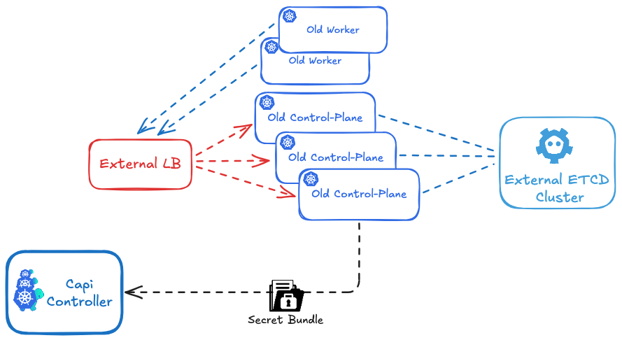
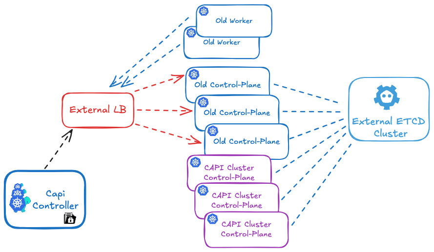

# Migrate a legacy K8s Kubeadm Cluster to a Capi K8s kubadm Cluster 

Currently, this procedure is in an experimental stage and should be thoroughly tested before being used in a production environment.
It is only compatible with an external ETCD and an external LBAAS.

It is designed create cluster.x-k8s.io/secret bundle to migrate a cluster created with kubeadm to a kubeadm-based cluster managed by Cluster API.
At this stage, the script has been developed specifically for the Cluster API Provider OpenStack (CAPO ).

My goal is to improve the process to transition from an external ETCD to a local ETCD on the control-plane nodes, and also to migrate from a local ETCD on legacy control-planes to a local ETCD on CAPI control-planes.

The key to this, based on my analysis, would be to force CAPI to add the first control-plane node using a kubeadm join instead of a kubeadm init.

In the case of an external ETCD, this works because the secrets and ETCD are already initialized. The kubeadm init command does not pose any issues, as the kubelet simply joins an already existing API endpoint.

Feel free to share any suggestions or ideas for improvements or future developments.


# Migration Process Overview

The procedure is based on having a hybrid legacy/CAPI cluster during the migration.

It is carried out in five main steps:

1. **Retrieving the necessary secrets and configurations** from the existing cluster.
2. **Preparing the Cluster API (CAPI) configuration**.
3. **Importing the secrets into CAPI**.
4. **Create the CAPI control-plane and CAPI worker nodes** on the existing cluster.
5. **Removing the nodes the old cluster nodes**.


## Prerequisites

- have a CAPI cluster CAPI Controller should have acces to the api url of the cluster to manage. (https://api.mylegacy_cluster.kubeadm)


## 1 - Retrieving the necessary secrets and configurations.



First, run the [prepare_secrets.sh](https://github.com/jfpucheu/devops-notes/blob/main/src/capi/prepare_secrets.sh) script on a control plane node, passing the name of the cluster you want to migrate as an argument. This name should match the `cluster_name` defined in CAPI.
You can find the script [Here](https://github.com/jfpucheu/devops-notes/blob/main/src/capi/prepare_secrets.sh).

The script will generate a file named `${CLUSTER_NAME}-secret-bundle.yaml`.

```
./prepare_secrets.sh ${CLUSTER_NAME}
```

and get the file:  ${CLUSTER_NAME}-secret-bundle.yaml

## 2 - Preparing the Cluster API (CAPI) configuration.

**Manual step: secret cloud.yaml**

Based on the file cloud.yaml , create your encoded secret cloud.yaml in base64.

```
export OPENSTACK_CLOUD_YAML_B64=$(cat cloud.yaml | base64)

# apply the secret in your Cluster-api cluster (run once )
envsubst < secret.yaml | kubectl apply -f -
```

based on env_example file create vars file for your cluster and source it:

```
source env_example
```

Now, based on the 'cluster-template-migration.yaml', generate your cluster configuration, and pay **close attention to the following parameters**:

For the example, I hardcoded the parameters directly in the code, but it's recommended to pass these values **as cluster environment variables instead**.

- External etcd endpoints in KubeadmControlPlane section :

```
    ...
    clusterConfiguration:
      etcd:
        external:
          caFile: /etc/kubernetes/pki/etcd/ca.crt
          certFile: /etc/kubernetes/pki/apiserver-etcd-client.crt
          keyFile: /etc/kubernetes/pki/apiserver-etcd-client.key
          endpoints:
          - https://192.168.10.10:2379
          - https://192.168.10.11:2379
          - https://192.168.10.12:2379
    ...
```


- External Api endpoints in OpenStackCluster section if you use CAPO:

```
    ...
    controlPlaneEndpoint:
    host: api.mydevcluster.com
    port: 443
    ...
```
- Add a secutitygroup rule in OpenStackCluster section if you use CAPO to allow traffic beween old and new clusters:

```
  ...
  managedSecurityGroups:
    allNodesSecurityGroupRules:
    - direction: ingress
      etherType: IPv4
      name: Allow old secutirygroup
      description: "Allow all between old and new control plane and workers"
      remoteGroupID: "old-secutity-group-id"
  ...
```

## 3 - Importing the secrets into CAPI.

Apply your  `${CLUSTER_NAME}-secret-bundle.yaml` into you CAPI Controller Cluster:
```
kubectl apply -f ${CLUSTER_NAME}-secret-bundle.yaml
```

## 4 - Create the CAPI control-plane and CAPI worker nodes



```
# create capi  ${CLUSTER_NAME} cluster
envsubst <  cluster-template-migration.yaml | kubectl apply -f
```

Since the etcd database is shared between the old and new cluster, and the PKI secrets (such as TLS certificates and private keys) are identical, creating this new Kubernetes cluster will actually result in the addition of new control plane and CAPI worker nodes to the existing cluster, rather than forming a separate cluster.

**Get your cluster state:**
```
# import secret bundle
kubectl apply -f ${CLUSTER_NAME}-secret-bundle.yaml -n $NAMESPACE

# Migrate  ${CLUSTER_NAME} cluster
envsubst <  cluster-template-migration.yaml | kubectl apply -n $NAMESPACE -f
```

## 5 - Remove the old cluster nodes
