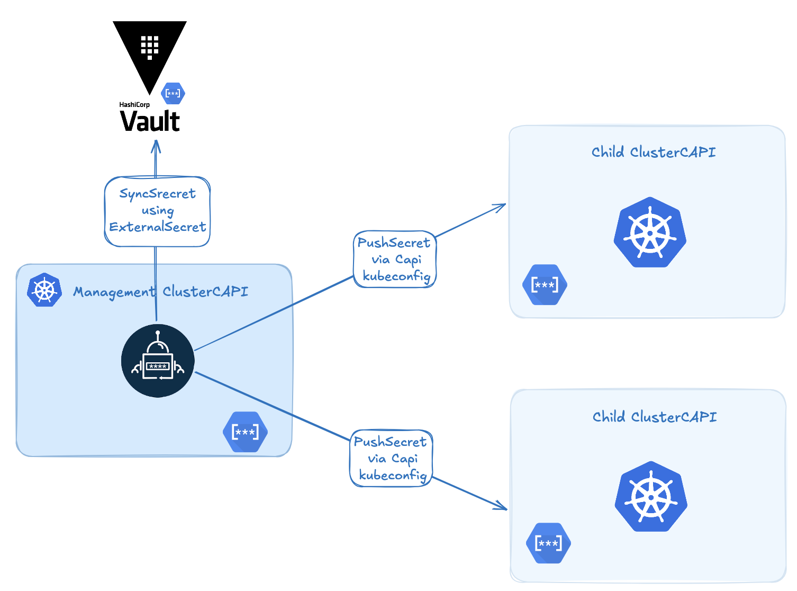

# 🌱 Securely Bootstrapping Secrets in a ClusterAPI Cluster with ExternalSecrets & PushSecret

<p align="center" width="90%">

</p>

When I started automating Kubernetes cluster creation using [ClusterAPI](https://cluster-api.sigs.k8s.io/), one problem kept coming back:

**How can I securely inject secrets into a brand new cluster right at bootstrap — without storing them in Git or relying on fragile post-install hacks?**

After a lot of searching, I found a hidden gem in [External Secrets Operator (ESO)](https://external-secrets.io/): the powerful but lesser-known **PushSecret** feature.


## 🌍 The Problem: Secure Secret Bootstrap

In a typical ClusterAPI setup, you have a **management cluster** that provisions **workload clusters**. That works great, but raises a tricky issue:

> **How can you get critical secrets (certs, tokens, credentials) into a cluster at creation time — securely, and without manual steps?**

Most solutions I found fell short:
- Putting secrets in Git (security nightmare),
- Writing brittle post-creation scripts,
- Waiting for the cluster to be ready before installing ESO/Vault (too late for early-stage secrets).


## 🔑 The Solution: ExternalSecrets + PushSecret

If you’ve used External Secrets Operator before, you likely know it for syncing secrets from Vault, AWS Secrets Manager, GCP Secret Manager, etc. to Kubernetes.

But what many people don’t know is that ESO has a very useful feature called **PushSecret**.

### 🧪 What Is PushSecret?

**PushSecret** lets you sync a Kubernetes secret *to another cluster* — **without installing ESO on the target cluster.**

That means you can:
- Define a secret source (Vault, AWS, or even a local `Secret`),
- Push it from the management cluster to a remote child cluster,
- Do this **without Git**, **without ESO installed on the target**, and **without manual work**.


## ⚙️ How Does It Work?

Here’s the basic idea:

1. Install ESO only on the **management cluster**.
2. Define a `ClusterSecretStore` (with kubeconfig) to point to the child cluster.
3. Create a `PushSecret` that selects a local secret and sends it to the target cluster.
4. ESO does the sync as soon as the child cluster API is available.

### PushSecret Example

And the corresponding `RemoteCluster`:

```yaml
apiVersion: external-secrets.io/v1
kind: ClusterSecretStore
metadata:
  name: mycapicluster-secretstore
  namespace: default
spec:
  provider:
    kubernetes:
      # with this, the store is able to pull only from `default` namespace
      remoteNamespace: default
      authRef:
        name: mycapicluster-kubeconfig # name of the kubeconfig child cluster on management cluster
        key: value
        namespace: default
```
💡 *These kubeconfigs are automatically generated by ClusterAPI or its bootstrap provider (CAPBK..*

```yaml
---
apiVersion: external-secrets.io/v1alpha1
kind: PushSecret
metadata:
  name: pushsecret-mysecret
spec:
  refreshInterval: 60s
  selector:
    secret:
      name: mysecret
  secretStoreRefs:
  - kind: ClusterSecretStore
    name: mycapicluster-secretstore
  data:
    - match:
        remoteRef:
          remoteKey: mysecret # Remote reference (where the secret is going to be pushed)

````

## 🎯 Real-World Use Cases

Here are some examples where PushSecret has been incredibly helpful:

* 🔐 Injecting CSI driver credentials (e.g., AWS EBS, AzureDisk, Vault CSI),
* 🔑 Sharing a global TLS certificate across all clusters,
* 📦 Distributing container registry tokens (e.g., GitHub Container Registry),
* ⚙️ Bootstrapping cert-manager or external-dns with initial secrets.

## Why ClusterAPI + ExternalSecrets = ❤️

The combination of **ClusterAPI** and **ExternalSecrets** is extremely powerful — because they work so well together.

When a management cluster uses CAPI to create a child cluster, it automatically:

* Generates the child’s **kubeconfig** and **CA**,
* Assigns a **predictable name** to the child cluster (based on the cluster object).

This means you **already know the child cluster name and its credentials** at creation time — no waiting, no guessing.

🎯 As a result, you can predefine a `PushSecret` pointing to the future cluster. As soon as the cluster’s API becomes available, ESO pushes the secret — **automatically**.


### 🔍 Concrete Example

Say you’re provisioning a new cluster named `dev-app01`. When ClusterAPI creates it, a `Secret` named `dev-app01-kubeconfig` is created in the `capi-system` namespace.

You can reference it like this:

```yaml
apiVersion: external-secrets.io/v1
kind: ClusterSecretStore
metadata:
  name: devcluster-secretstore
  namespace: kube-system
spec:
  provider:
    kubernetes:
      # with this, the store is able to pull only from `default` namespace
      remoteNamespace: kube-system
      authRef:
        name: devcluster-kubeconfig # name of the kubeconfig child cluster on management cluster
        key: value
        namespace: devcluster
---
apiVersion: external-secrets.io/v1alpha1
kind: PushSecret
metadata:
  name: registry-token-push
  namespace: kube-system
spec:
  refreshInterval: 60s
  selector:
    secret:
      name: registry-token
      namespace: kube-system
  secretStoreRefs:
  - kind: ClusterSecretStore # Depending the type of secret you can use SecretStore or ClusterSecretStore
    name: devcluster-secretstore
  data:
    - match:
        remoteRef:
          remoteKey: registry-token # Remote reference (where the secret is going to be pushed)
```

This can be templated and automated via GitOps as soon as a new cluster is declared. The secret will be **in place by the time the cluster is ready**.

## ✅ Benefits

* 🔐 **Secure:** No secrets in Git.
* ⚙️ **Automated:** Push as soon as the API is ready.
* 🧼 **Minimal:** Only install ESO on the management cluster.
* 🌐 **Flexible:** Works with Vault, AWS, GCP, Azure, and Kubernetes native secrets.


## 🧵 In Summary

If you’re using ClusterAPI and want a secure, automated way to inject secrets into clusters from day one — check out the **PushSecret** feature in ExternalSecrets Operator.

It solved a long-standing pain point for me — and might save you hours of scripting and debugging too.

📘 Official Docs:

- [ExtenalSecret Pushsecrets](https://external-secrets.io/latest/guides/pushsecrets/)
- [Cluster-Api](https://cluster-api.sigs.k8s.io/)