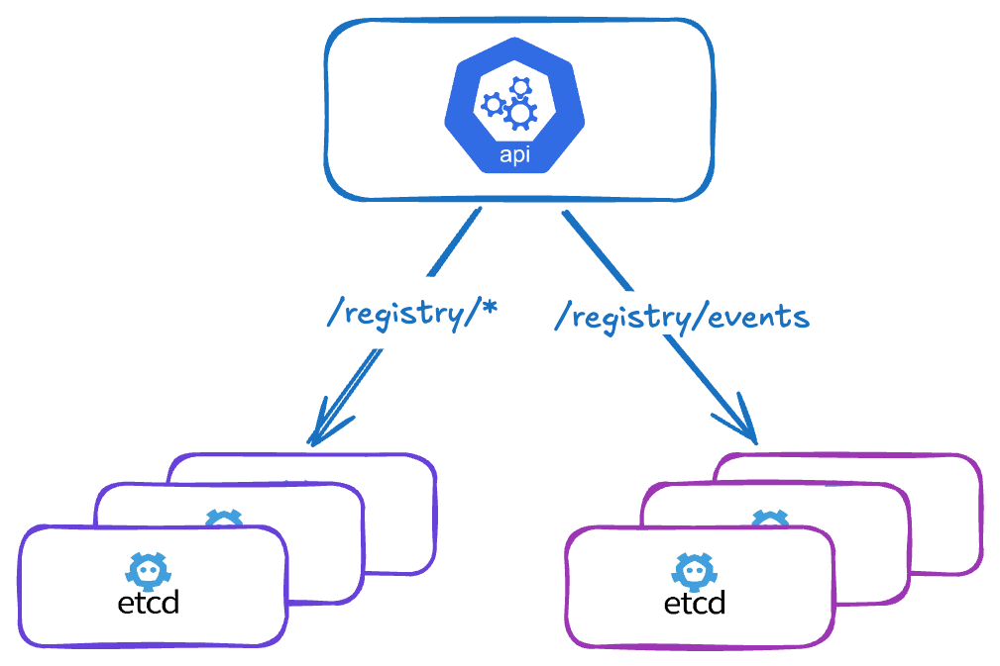

# Split your events (or other keys) into separate etcd clusters
(Stop Letting Kubernetes Events Kill Your etcd — Here's the Fix)

<p align="center" width="100%">

</p>

In large Kubernetes clusters, **events** can quickly become a problem. While they are useful for debugging and observability, they generate a very high volume of writes to etcd, which can **severely degrade the performance** of the main etcd cluster and therefore impact the entire Kubernetes API.

---

## Problem

In Kubernetes, events are stored in etcd under the prefix `/registry/events`.
In high-activity environments (many pods, deployments, controllers…), this prefix becomes heavily used:

- Massive and continuous writes
- High data turnover (short TTL by default: 1h)
- Pressure on etcd storage and CPU
- More frequent etcd compaction and defragmentation

---

## Solution: offload certain keys to a dedicated etcd

Kubernetes allows **redirecting certain keys to a separate etcd cluster** via the kube-apiserver flag:

```
--etcd-servers-overrides
```

### Format

```
--etcd-servers-overrides=<prefix>#<server1>,<server2>,<server3>
```

> Servers within the same group are separated by **commas** (`,`).
> Multiple overrides are also separated by **semicolons** (`;`).

### kube-apiserver configuration example

```yaml
# Main etcd
- --etcd-servers=https://10.0.0.11:2379,https://10.0.0.12:2379,https://10.0.0.13:2379
- --etcd-cafile=/etc/kubernetes/pki/etcd/ca.crt
- --etcd-certfile=/etc/kubernetes/pki/apiserver-etcd-client.crt
- --etcd-keyfile=/etc/kubernetes/pki/apiserver-etcd-client.key

# Offloading events to a dedicated etcd cluster
- --etcd-servers-overrides=/events#https://10.0.1.20:2379,https://10.0.1.21:2379,https://10.0.1.22:2379
```

---

## Benefits

- Reduced load on the main etcd
- Better overall API server performance
- Isolation of highly volatile data
- Independent scalability of both clusters
- Independent compaction/defragmentation cycles

---

## Limitations and constraints

### Shared authentication

The kube-apiserver uses the **same TLS client certificates** (`etcd-certfile` / `etcd-keyfile`) for all etcd clusters, including overrides. It is not possible to specify different certificates per cluster.

In practice: both etcd clusters must be signed by the **same CA** and accept the same kube-apiserver client certificate.

### Availability

If the events-dedicated etcd becomes unavailable:

- The kube-apiserver keeps attempting to write/read events
- Timeouts and retries impact overall performance
- The main etcd remains operational, but the API server is degraded

---

## Best practices

- Deploy the events etcd in high availability (minimum 3 nodes)
- Monitor both etcd clusters separately
- Tune event retention: `--event-ttl=1h` (default value)
- Limit overrides to highly volatile keys (events, leases…)
- Do not offload critical keys such as `/registry/pods` or `/registry/secrets`

---

## Other candidate keys

Beyond events, other prefixes can be offloaded depending on the use case:

| Prefix | Description |
|---|---|
| `/events` | Kubernetes events (most common case) |
| `/leases` | Leader election and node heartbeats |
| `/pods` | Not recommended — critical key |

---

## Conclusion

Offloading `/registry/events` to a separate etcd cluster is an effective optimization for large Kubernetes clusters where events become a real bottleneck.

This must be set up carefully: the dedicated etcd must be highly available, and both clusters must share the same PKI.

> Primarily intended for very high-throughput production environments.
