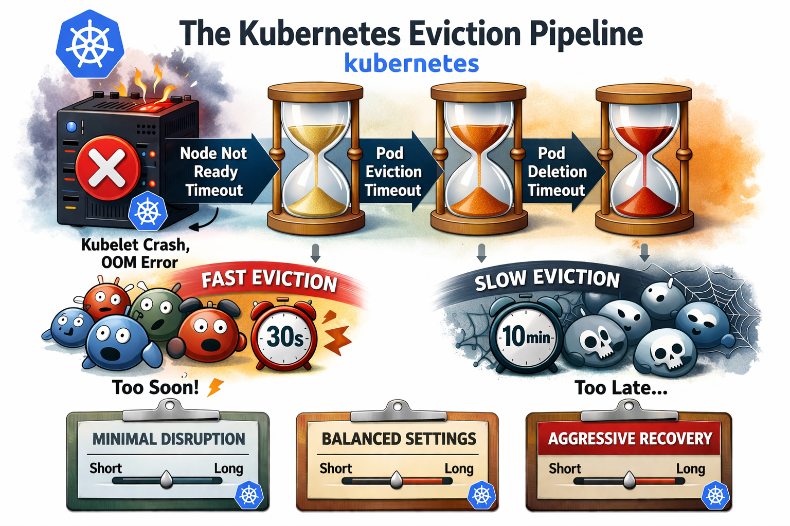
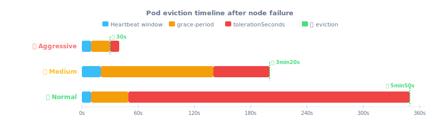

# Pod Eviction When a Node Goes NotReady or Unreachable



When a Kubernetes node disappears — network failure, kubelet crash, OOM — your pods don't evict instantly. There's a deliberate pipeline of timeouts that decides *when* and *whether* to reschedule workloads. Misconfigure it and you get two equally bad outcomes: pods evicted after 30 seconds on a node that was just briefly overloaded, or pods stuck for 10 minutes on a genuinely dead node.

This article explains how the eviction pipeline works, what each knob does, and gives you three ready-to-use configurations depending on your tolerance for disruption.

---

## How the eviction pipeline works

Three components cooperate in sequence:

| Component | Role |
|---|---|
| `kubelet` | Sends heartbeats every `nodeStatusUpdateFrequency` |
| `node-lifecycle-controller` (kcm) | Watches heartbeats, sets `Ready=False/Unknown`, applies taints |
| `taint-eviction-controller` (kcm) | Evicts pods once `tolerationSeconds` expires |

The total eviction time is always:

```
T_eviction = node-monitor-grace-period + tolerationSeconds
```

### NotReady vs Unreachable — two different taints

| | `NotReady` | `Unreachable` |
|---|---|---|
| Node condition | `Ready=False` | `Ready=Unknown` |
| Taint applied | `node.kubernetes.io/not-ready:NoExecute` | `node.kubernetes.io/unreachable:NoExecute` |
| Typical cause | Kubelet degraded, OOM, disk pressure | Network failure, OS crash, node powered off |
| Kubelet responding? | Partially | Not at all |
| False positive risk | Medium | **High** (network flapping) |

Both taints trigger eviction via `tolerationSeconds`. The difference is the *cause*, not the mechanism.

### The golden rule

```
node-monitor-grace-period ≥ 3 × nodeStatusUpdateFrequency
```

This ensures at least **3 missed heartbeats** are required before a node is declared unhealthy. Anything less and a momentary kubelet hiccup or network blip can evict production pods unnecessarily.

---

## Timeline — what actually happens

### When a node goes NotReady (kubelet degraded)

```
T+0s    kubelet stops sending heartbeats
T+Xs    last known heartbeat (depends on nodeStatusUpdateFrequency)
T+Gs    grace-period expires → taint not-ready:NoExecute applied
T+G+Ts  tolerationSeconds expires → pods enter Terminating
```

### When a node goes Unreachable (network / crash)

Same timeline, but the taint is `unreachable:NoExecute` and `Ready=Unknown` instead of `Ready=False`.
The risk of false positives is higher — a 30-second network partition is enough to trigger eviction with an aggressive config.

---

## Eviction timeline — the three scenarios compared



---

## The three configurations

### 🔴 Aggressive — fast failover, high false positive risk

**Use case:** stateless workloads, HA deployments where you want fast rescheduling and can tolerate occasional unnecessary evictions.

```yaml
# kube-apiserver
--default-not-ready-toleration-seconds=10
--default-unreachable-toleration-seconds=10

# kube-controller-manager
--node-monitor-period=2s
--node-monitor-grace-period=20s
--terminated-pod-gc-threshold=50

# kubelet
nodeStatusUpdateFrequency: 10s
```

Pod tolerations (auto-injected):
```yaml
tolerations:
  - effect: NoExecute
    key: node.kubernetes.io/not-ready
    operator: Exists
    tolerationSeconds: 10
  - effect: NoExecute
    key: node.kubernetes.io/unreachable
    operator: Exists
    tolerationSeconds: 10
```

```
T_eviction = 20s + 10s = 30s
Golden rule: 20s ≥ 3×10s=30s → ❌ NOT MET (only 2 missed heartbeats)
```

> ⚠️ A kubelet under CPU pressure or a 15-second network blip is enough to evict pods. Not recommended for stateful workloads or clusters with variable network latency.
>
> **Well suited for** small, fast-starting containers that reschedule in seconds and have no local state — think sidecars, short-lived jobs, or replicated stateless services with multiple replicas.
>
> **Watch out during apiserver maintenance:** if your control plane sits behind a load balancer or kube-vip, a leader failover or VIP switchover can take 10–30 seconds. With a 30s eviction window, pods may start evicting before the new apiserver is reachable — causing a cascade that wouldn't happen with a less aggressive config. Make sure your LB/kube-vip failover time is well below `tolerationSeconds`.

---

### 🟡 Medium — tolerant to flapping, faster than default

**Use case:** bare-metal clusters, industrial environments, nodes with slow or unreliable heartbeat paths (high kubelet `nodeStatusUpdateFrequency`), or any cluster where false evictions are more costly than slow recovery.

```yaml
# kube-apiserver
--default-not-ready-toleration-seconds=60
--default-unreachable-toleration-seconds=60

# kube-controller-manager
--node-monitor-period=5s
--node-monitor-grace-period=2m
--terminated-pod-gc-threshold=50

# kubelet
nodeStatusUpdateFrequency: 20s
```

Pod tolerations:
```yaml
tolerations:
  - effect: NoExecute
    key: node.kubernetes.io/not-ready
    operator: Exists
    tolerationSeconds: 60
  - effect: NoExecute
    key: node.kubernetes.io/unreachable
    operator: Exists
    tolerationSeconds: 60
```

```
T_eviction = 120s + 60s = 3min
Golden rule: 120s ≥ 3×20s=60s → ✅ MET (6 missed heartbeats)
```

> The kubelet heartbeats every 20s, and 6 consecutive misses are required before the node is considered unhealthy. Very resilient to network flapping and temporary kubelet load spikes. Recommended for CAPI-managed clusters and environments where nodes are provisioned/deprovisioned frequently.

---

### 🟢 Normal — general purpose <!-- default Kubernetes configuration -->

**Use case:** general-purpose clusters, mixed workloads. Good balance between recovery speed and false positive tolerance.

```yaml
# kube-apiserver
--default-not-ready-toleration-seconds=300
--default-unreachable-toleration-seconds=300

# kube-controller-manager
--node-monitor-period=5s
--node-monitor-grace-period=40s
--terminated-pod-gc-threshold=12500

# kubelet
nodeStatusUpdateFrequency: 10s
```

Pod tolerations:
```yaml
tolerations:
  - effect: NoExecute
    key: node.kubernetes.io/not-ready
    operator: Exists
    tolerationSeconds: 300
  - effect: NoExecute
    key: node.kubernetes.io/unreachable
    operator: Exists
    tolerationSeconds: 300
```

```
T_eviction = 40s + 300s = ~5min40s
Golden rule: 40s ≥ 3×10s=30s → ✅ MET (4 missed heartbeats)
```

> These are close to the Kubernetes upstream defaults. The 5-minute `tolerationSeconds` means pods stay on a dead node for a while before rescheduling — which is intentional to avoid thundering herd on short outages.

---

## Comparison summary

| | 🔴 Aggressive | 🟡 Medium | 🟢 Normal (default) |
|---|---|---|---|
| `nodeStatusUpdateFrequency` | 10s | 20s | 10s |
| `node-monitor-grace-period` | 20s | 120s | 40s |
| `tolerationSeconds` | 10s | 60s | 300s |
| **Total eviction time** | **~30s** | **~3min** | **~5min40s** |
| Golden rule met | ❌ | ✅ | ✅ |
| Missed heartbeats before eviction | 2 | 6 | 4 |
| False positive risk | High | Very low | Low |
| Best for | Stateless, HA | Bare-metal, industrial | General purpose |

---

## Key takeaways

- **Always verify the golden rule** `grace-period ≥ 3 × heartbeat` — violating it makes eviction non-deterministic.
- **`tolerationSeconds` is injected at pod creation** by the `DefaultTolerationSeconds` admission plugin — changing the apiserver flag only affects *new* pods, not running ones.
- **Unreachable is riskier than NotReady** for false positives. A 30-second network partition is invisible to users but enough to trigger eviction in an aggressive config.
- **Node shutdown** is a separate mechanism (`shutdownGracePeriod` on kubelet) — the eviction pipeline above only applies to unexpected failures.
- For **stateful workloads** (databases, queues), always use Medium or at minimum Normal, and consider Pod Disruption Budgets on top.

---

## Conclusion

These parameters are not cosmetic — they directly control how your cluster reacts to failure, and a wrong value in either direction causes real damage: unnecessary disruption of healthy workloads, or pods stuck on dead nodes for minutes.

There is no universal right answer. The correct values depend on three things you need to assess together:

- **Your workloads** — a stateless nginx replica and a PostgreSQL primary do not have the same tolerance for eviction. Fast-starting containers can afford aggressive settings; anything with local state, slow startup, or strict ordering cannot.
- **Your services** — a batch job tolerates 5 minutes of downtime; a payment API does not. SLOs and SLAs should drive your `tolerationSeconds`, not the other way around.
- **Your underlying infrastructure** — bare-metal with occasional flapping NICs, a cloud provider with live migration, kube-vip with a 20-second failover, or a CAPI-managed cluster that reprovisioning nodes regularly all have different heartbeat reliability profiles.

When in doubt, start with **Normal** (the Kubernetes default), measure actual node failure and recovery times in your environment, then adjust. Going aggressive without understanding your LB failover time or kubelet startup latency is a reliable way to cause incidents during maintenance windows.
