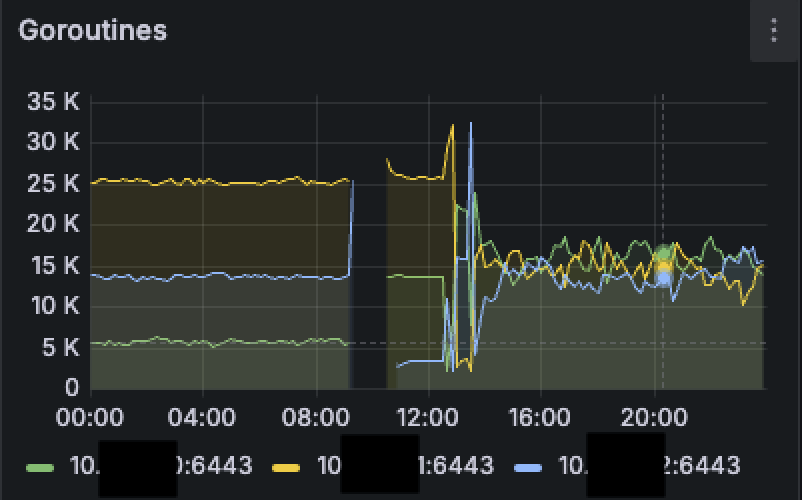
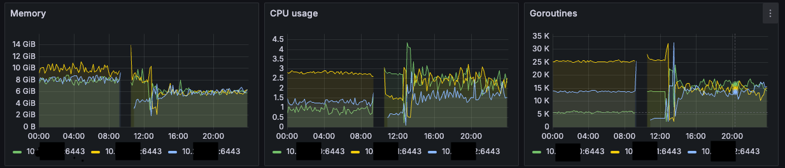

# `--goaway-chance`: The Parameter You Should Know to Keep Your Kubernetes API Server Stable 🚀

<p align="center" width="100%">

</p>
In many Kubernetes clusters where a **load balancer** sits in front of multiple `kube-apiserver` instances, it's common to observe **uneven load distribution** among API servers. This is an issue I’ve encountered several times and spent a lot of time investigating. 🕵️‍♂️

## Symptoms ⚠️

- The most recently started `kube-apiserver` receives very little traffic.
- The number of active **goroutines** on that server is significantly lower than on the others.
- During upgrades or restarts, one server can become **overloaded**, taking over all the connections from a previously stopped instance, sometimes resulting in **OOMKilled** errors.💥

## Root Cause 🧠

The `kube-apiserver` uses **HTTP/2** and maintains **persistent connections**. Once established, these connections are **never rotated** or rebalanced, regardless of the load balancing algorithm being used (round-robin, IP hash, etc.).

As a result, if you have three API servers and one of them restarts, it will not receive any new connections automatically. The already established client connections remain bound to the older servers, leaving the newly restarted one **idle**. 💤

## The Solution: `--goaway-chance` 🛠️

The `--goaway-chance` parameter in `kube-apiserver` is a **powerful but often overlooked** option that can dramatically improve **control plane stability** in large clusters. 💡

### Official Description 📘

> To prevent HTTP/2 clients from getting stuck on a single API server, this flag allows the server to **randomly close a connection** by sending a `GOAWAY` signal.  
> Ongoing requests will not be interrupted, and the client will reconnect, often hitting a **different API server** through the load balancer. 🔄

- **Range**: from `0` (disabled) to `0.02` (2% of requests).
- **Recommended starting point**: `0.001` (0.1%, or 1 in every 1000 requests).
- **Warning**: Do **not** enable this if you have a **single API server** or **no load balancer** in front. ⚠️

### Configuration Example 🧪

Add the following flag to your `kube-apiserver` startup configuration:

```bash
--goaway-chance=0.001
```

### Expected Result 📊

Once enabled, you'll likely observe a **balanced load** across all your API servers. Here's a simple before/after illustration:

```
Before:
- server 1: 70% load
- server 2: 30%
- server 3: 0%

After enabling --goaway-chance:
- server 1: 33%
- server 2: 33%
- server 3: 33%
```
This helps **prevent overloads** and ensures better **resource utilization** across your control plane.


*On the graph below, we can see the difference before and after applying the parametermage_caption*

## Conclusion 🎯

If you're running multiple `kube-apiserver` instances behind a load balancer, the `--goaway-chance` parameter is an essential tool to **ensure load distribution and cluster stability**. 🔐

It’s easy to configure, has minimal impact, and can prevent costly downtimes or crashes during maintenance operations. ⏱️

Don’t overlook it. 💪
