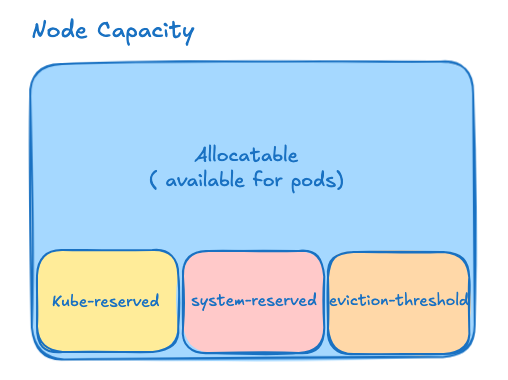

# kube-tuning

## 🛠️ Kubernetes Node Stability and Performance: Tuning Kubelet for Better Resource Management

**Author's note**: This is a practical guide for Kubernetes operators and administrators looking to improve cluster resilience and performance by fine-tuning `kubelet` parameters. The focus is on preventing node crashes and optimizing resource usage, especially for clusters running in production environments.

<p align="center" width="100%">

</p>

## 🚨 Why Tuning Matters

In a Kubernetes cluster, **nodes are the foundation**—if a node goes down, all the workloads (pods) running on it are impacted. One common cause of node instability is poor resource management at the kubelet level. Without proper reservations and eviction policies, pods can consume all the system memory or CPU, leading to **Out of Memory (OOM)** errors or even system crashes.

This article covers two key areas of kubelet tuning:

1. **Resource Reservations and Evictions**
2. **Graceful Node Shutdown Settings**

The goal is to help you configure your nodes so they **remain stable under load**, **avoid system-level OOMs**, and **terminate gracefully when needed**, particularly on platforms like **OpenStack**.


## ⚙️ 1. Reserve Resources to Protect the Node

### ❗ Problem

By default, if you don't reserve any resources for system or kubelet processes, pods can consume **100% of a node’s memory or CPU**. This can starve the system, cause critical services to crash, and render the node temporarily unusable.

### ✅ Solution: Use `kubeReserved`, `systemReserved`, and `evictionHard`

- **`systemReserved`**: Resources set aside for system-level processes (e.g., systemd, journald).
- **`kubeReserved`**: Resources reserved for Kubernetes components like kubelet, container runtime, etc.
- **`evictionHard`**: Memory and storage thresholds at which kubelet starts evicting pods before the system runs out of resources completely.

### 🔧 Example Configuration

```yaml
kubeReserved:
  cpu: 420m
  memory: 9Gi
systemReserved:
  cpu: 100m
  memory: 1Gi
evictionHard:
  memory.available: 100Mi
  nodefs.available: 10%
  imagefs.available: 15%
  nodefs.inodesFree: 5%
```

💡 These values can be adjusted based on your node specs (CPU cores, total memory). Below is a basic recommendation logic for automation tools like Ansible

```yaml
KubeletKubeReservedMemory: >-
  13Gi
  9Gi
  6Gi
  4Gi
  3Gi
  2Gi
  1Gi
  255Mi
  
KubeletKubeReservedCpu: >-
  740m
  420m
  260m
  180m
  140m
  100m
  60m
  10m
  
```

```yaml
apiVersion: kubelet.config.k8s.io/v1beta1
kind: KubeletConfiguration
kubeReserved:
  cpu: {{ KubeletKubeReservedCpu }}
  memory: {{ KubeletKubeReservedMemory }}
systemReserved:
  cpu: 100m
  memory: 1Gi
evictionHard:
  memory.available: 100Mi
  nodefs.available: 10%
  imagefs.available: 15%
  nodefs.inodesFree: 5%
```

📘 Official Docs:
 Kubernetes Resource Reservations
 Reserve-compute-resources


📘 More details: 

- [Reserve-compute-resources](https://kubernetes.io/docs/tasks/administer-cluster/reserve-compute-resources/).
- [Kubernetes Resource Reservations](https://kubernetes.io/docs/concepts/configuration/manage-resources-containers/).


Part of this tuning could be enabled by default on images built with Image Builder. You can find the script [here](https://github.com/kubernetes-sigs/image-builder/blob/main/images/capi/ansible/roles/kubernetes/files/usr/libexec/kubernetes/kubelet-resource-sizing.sh).


## ⏱️ 2. Configure Graceful Shutdown for Your Nodes

### ❗ Problem

During system shutdown or reboot (planned or unplanned), nodes can terminate without properly shutting down running pods. This can result in data loss, application errors, and inconsistent states.


### ✅ Solution: Enable and Tune `shutdownGracePeriod`

Kubelet uses systemd inhibitor locks to delay the node shutdown and give time for pods to terminate gracefully. This feature improves application reliability, especially for stateful or critical services.

### 🔧 Recommended Settings:

```yaml
shutdownGracePeriod=60s
shutdownGracePeriodCriticalPods=30s
```

This configuration:

- Reserves 60 seconds to complete the node shutdown.
- Gives 30 seconds to gracefully shut down regular pods.
- Keeps the last 30 seconds for critical system pods.

📘 Official Docs:

- [Graceful Node Shutdown (K8s Docs)](https://kubernetes.io/docs/concepts/cluster-administration/node-shutdown/)
- [Kubernetes Blog Post](https://kubernetes.io/blog/2021/04/21/graceful-node-shutdown-beta/)

## ✅ Final Thoughts

Tuning your kubelet settings is a low-effort, high-impact improvement that can drastically increase the resilience and performance of your Kubernetes nodes. Especially in production environments or cloud platforms like OpenStack, it's crucial to:
Reserve resources for essential system components
Define eviction thresholds to avoid OOM errors
Gracefully shut down workloads to avoid data corruption

By applying these best practices, you ensure that your nodes stay healthy and your applications remain available - even under heavy load or system shutdown events.


