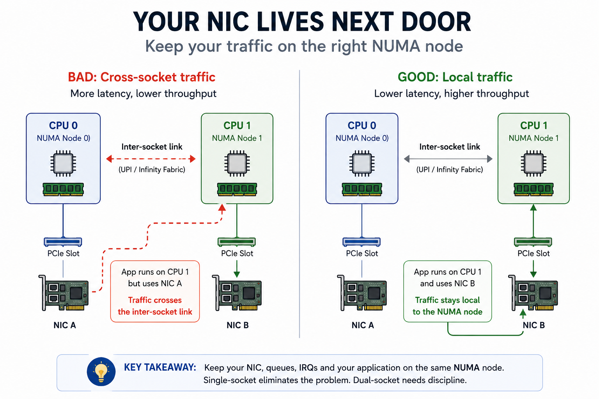

# Votre carte réseau habite chez le voisin (et ça ralentit tout)



Vous avez un serveur bisocket flambant neuf, un lien 25 ou 100 Gbit/s, et pourtant les débits mesurés sont en dessous de ce que vous attendiez. La carte réseau va bien, le câble va bien, le switch va bien. Le vrai problème, c'est que votre CPU et votre carte réseau ne vivent peut-être pas sous le même toit : câblée sur l'autre socket, la carte est un peu comme un colocataire installé chez le voisin — chaque échange demande de traverser le palier, et ça se paie en latence.

---

## Un serveur bisocket, ce sont deux ordinateurs qui se tiennent la main

Un serveur "bisocket" n'est pas un seul gros cerveau. Ce sont deux processeurs séparés, chacun avec :

- ses propres cœurs de calcul,
- sa propre mémoire RAM directement raccordée,
- ses propres lignes PCIe (le bus qui alimente les cartes réseau, les cartes de stockage, les GPU...).

Les deux processeurs se parlent via un lien dédié : QPI ou UPI chez Intel, Infinity Fabric chez AMD. C'est rapide, mais ce n'est pas gratuit : chaque aller-retour par ce lien coûte du temps et de la bande passante.

C'est le principe **NUMA** (*Non-Uniform Memory Access*) : selon l'endroit où se trouve la donnée, y accéder est rapide (mémoire locale) ou plus lent (mémoire de l'autre socket).

## Le schéma qui change tout

```
                         Lien inter-socket (UPI / Infinity Fabric)
                    ┌───────────────────────────────────────────┐
                    │                                             │
        ┌───────────┴───────────┐                 ┌───────────────┴─────────┐
        │        CPU 0          │                 │          CPU 1          │
        │   (Nœud NUMA 0)       │                 │     (Nœud NUMA 1)       │
        │                       │                 │                          │
        │  Cœurs 0-15           │                 │  Cœurs 16-31             │
        │  RAM locale           │                 │  RAM locale              │
        │  Lignes PCIe          │                 │  Lignes PCIe             │
        └───────────┬───────────┘                 └───────────┬──────────────┘
                    │                                             │
             Slot PCIe #1                                  Slot PCIe #2
                    │                                             │
           ┌────────┴────────┐                           ┌───────┴────────┐
           │  Carte réseau A │                           │ Carte réseau B │
           └─────────────────┘                           └────────────────┘
```

Une carte réseau se branche sur le bus PCIe, et sur une carte mère bisocket, chaque slot PCIe est câblé physiquement vers l'un ou l'autre des deux processeurs — jamais vers les deux à la fois.

Si une application tourne sur des cœurs du CPU 1 mais utilise la **carte A**, câblée sur le CPU 0, chaque paquet reçu doit traverser le lien inter-socket avant d'être traité. Latence ajoutée, bande passante d'interconnexion consommée, performance dégradée — surtout visible à fort débit ou fort taux de paquets par seconde.

## Comment identifier le problème

### Vérifier le nœud NUMA d'une carte réseau

```bash
# Topologie NUMA globale
numactl --hardware
lstopo

# Nœud NUMA d'une interface réseau
cat /sys/class/net/eth0/device/numa_node
```

Si cette dernière commande renvoie `0`, la carte est câblée sur le CPU 0. Si l'application tourne sur des cœurs du CPU 1, le problème est identifié.

### Vérifier combien de CPU et quels CPU sont réellement utilisés par un processus

Connaître le nœud NUMA d'une carte réseau ne suffit pas : il faut aussi savoir sur quels cœurs tourne réellement le processus qui traite le trafic.

```bash
# Liste des CPU autorisés pour le processus haproxy
grep Cpus_allowed_list /proc/$(pgrep -o haproxy)/status
```

Cette commande affiche la liste des cœurs sur lesquels le processus HAProxy est autorisé à s'exécuter (son *affinity mask*). Si cette liste couvre les deux sockets, le scheduler Linux peut librement déplacer le processus d'un nœud NUMA à l'autre — y compris vers un cœur éloigné de la carte réseau utilisée.

```bash
# Nombre de files (queues) configurées sur la carte réseau
ethtool -l enp1s0
```

Cette commande montre le nombre de canaux (RX/TX queues) configurés sur l'interface `enp1s0`. Chaque file peut être traitée par une interruption dédiée, elle-même assignée à un cœur précis : c'est ce qui permet de répartir la charge réseau sur plusieurs cœurs du bon nœud NUMA plutôt que sur un seul.

```bash
# Affinité CPU d'un processus déjà lancé (via son PID)
taskset -cp <PID>
```

`taskset` permet de consulter (et, avec les bons arguments, de modifier) l'affinité CPU d'un processus en cours d'exécution. Combinée à la commande précédente sur `Cpus_allowed_list`, elle permet de vérifier — ou de forcer — qu'un processus reste cantonné aux cœurs du nœud NUMA où se trouve sa carte réseau.

📎 [Mindmap des concepts NUMA, carte réseau et affinité CPU](img/mindmap_CPU.png)

### Multiqueue : la carte réseau aussi peut faire du multitâche

Par défaut, sur de nombreuses distributions Linux, le multiqueue n'est pas forcément actif ou correctement dimensionné à l'installation. Il est donc important de le vérifier et, le cas échéant, de l'activer ou de l'ajuster — surtout sur des interfaces rapides (10 Gbit/s et au-delà) où un seul cœur peut rapidement devenir le goulot d'étranglement.

Sans multiqueue, toutes les interruptions réseau sont traitées par un seul cœur : peu importe le nombre de cœurs disponibles sur le bon nœud NUMA, un seul porte toute la charge. C'est particulièrement pénalisant sur des workloads à fort taux de nouvelles connexions ou de paquets par seconde, comme un load balancer.

On active ou ajuste le nombre de files avec :

```bash
# Passer à 4 files combinées RX/TX
ethtool -L enp1s0 combined 4
```

La valeur choisie doit rester inférieure ou égale au nombre de cœurs disponibles sur le nœud NUMA local de la carte : au-delà, des files seraient assignées à des cœurs du mauvais socket, ce qui annulerait une partie du bénéfice. Pour que ce réglage survive à un redémarrage, il faut le persister via la configuration réseau du système (`/etc/network/interfaces`, `udev`, `systemd-networkd` ou un script `post-up` selon la distribution).

Une carte réseau moderne ne pousse pas tout son trafic vers un seul cœur : elle répartit les paquets entrants et sortants dans plusieurs **files d'attente matérielles** (queues), gérées directement par la carte. C'est ce qu'on appelle le **multiqueue**.

La sortie de `ethtool -l enp1s0` ressemble à ceci :

```
Channel parameters for enp1s0:
Pre-set maximums:
RX:             0
TX:             0
Other:          1
Combined:       8
Current hardware settings:
RX:             0
TX:             0
Other:          1
Combined:       4
```

- **Pre-set maximums** : le nombre maximal de files que la carte peut techniquement gérer (ici 8 canaux combinés au maximum).
- **Current hardware settings** : le nombre de files réellement actives (ici 4 canaux combinés).
- **Combined** : un canal combiné gère à la fois une file de réception (RX) et une file d'émission (TX). Certaines cartes séparent au contraire les files RX et TX en compteurs distincts, qui apparaissent alors sur les lignes `RX` et `TX` plutôt que sur `Combined`.

Le mécanisme qui décide dans quelle file atterrit chaque paquet s'appelle le **RSS** (*Receive Side Scaling*) : la carte calcule un hachage à partir de certains champs de l'en-tête du paquet — en général les adresses IP et ports source/destination — et ce hachage détermine la file de destination. Les champs exacts pris en compte sont configurables et dépendent de la carte et de son driver. Résultat : les paquets d'une même connexion restent sur la même file (donc le même cœur), tandis que des connexions différentes peuvent être traitées en parallèle sur des cœurs différents.

Chaque file est associée à sa propre interruption (IRQ). C'est cette IRQ qu'on peut ensuite épingler à un cœur précis — idéalement un cœur du même nœud NUMA que la carte réseau — via `/proc/irq/<numéro>/smp_affinity` ou `irqbalance`.

Sans configuration explicite, rien ne garantit que ces IRQ (et donc le traitement des paquets) restent sur le bon nœud NUMA — c'est là que le lien avec la section précédente se referme : carte réseau, files, interruptions et affinité du processus doivent tous pointer vers le même socket pour éviter la traversée inutile du lien inter-CPU.

## Les leviers pour limiter l'impact

- **Affinité des IRQ (interruptions)** : configurer les interruptions de la carte réseau pour qu'elles soient traitées par des cœurs du bon nœud NUMA (via `irqbalance` ou une configuration manuelle des affinités CPU).
- **Épinglage des processus (`numactl`, `taskset`)** : lancer les applications sensibles au réseau sur les cœurs du même nœud NUMA que la carte réseau utilisée.
- **Placement physique** : lors du choix des slots PCIe pour les cartes réseau, privilégier ceux rattachés au socket qui héberge les workloads réseau critiques.
- **Virtualisation** : dans un contexte de VM ou de conteneurs (Kubernetes, KVM...), s'assurer que le scheduler tient compte de la topologie NUMA (CPU pinning, NUMA-aware scheduling).

## Mono-socket ou bisocket ? Un cas concret : HAProxy

Cette question de topologie n'est pas qu'académique : elle influence directement le choix du matériel pour des rôles réseau-intensifs, comme un load balancer type HAProxy.

### Ce qu'HAProxy sait faire tout seul

Bonne nouvelle : HAProxy n'est pas totalement aveugle à ce sujet, il propose deux réglages directement liés à NUMA et à l'affinité CPU.

- **`nbthread <nombre>`** définit le nombre de threads sur lesquels HAProxy va s'exécuter. Sur les plateformes qui le permettent, si aucune valeur n'est précisée, HAProxy détecte automatiquement le nombre de cœurs auxquels le processus est lié au démarrage et règle `nbthread` en conséquence — ce qui veut dire qu'on peut ajuster ce nombre de threads simplement en contraignant le processus avec `taskset` ou `cpuset` avant de le lancer, sans toucher à la configuration. Sans détection ni réglage explicite, la valeur par défaut retombe à 1. La valeur effectivement retenue est visible dans la sortie de `haproxy -vv`.
- **`numa-cpu-mapping`** va plus loin : sur une machine NUMA, cette directive permet à HAProxy d'inspecter lui-même la topologie matérielle et de choisir le meilleur jeu de cœurs à utiliser, ainsi que le nombre de threads correspondant. Ce comportement automatique s'efface dès qu'on définit soi-même `nbthread`, qu'on fixe l'affinité du processus autrement (via `cpu-map`, `taskset`...), ou qu'on désactive explicitement la fonctionnalité avec `no numa-cpu-mapping` si le placement automatique s'avère sous-optimal sur une architecture donnée.

Concrètement, sur un bisocket, `numa-cpu-mapping` peut faire une bonne partie du travail décrit plus haut à la place de l'administrateur : détecter le nœud NUMA pertinent et y cantonner les threads HAProxy. Mais cela reste une automatisation logicielle d'un problème matériel — elle ne dispense pas de vérifier que la carte réseau elle-même, ses files et ses IRQ sont alignées sur ce même nœud NUMA.

La documentation officielle HAProxy va dans le même sens sur le fond : sur une machine bisocket, elle déconseille de répartir le traitement entre les deux sockets physiques et recommande plutôt d'utiliser tous les cœurs d'un seul CPU physique, tant le coût de communication entre les deux CPU est élevé. Si malgré tout une charge SSL/TLS lourde justifie d'exploiter les deux sockets, la même documentation suggère d'assigner une carte réseau dédiée à chaque socket, afin que chaque groupe de threads ne dialogue qu'avec la carte réseau de son propre CPU.

### Mono-socket vs bisocket

**En faveur du mono-socket :**

- HAProxy est avant tout un consommateur de **réseau et de quelques cœurs**, rarement gourmand en RAM ou en calcul massif. Un CPU récent à fréquence élevée, même avec peu de cœurs, couvre largement le besoin.
- En mono-socket, **il n'existe qu'un seul nœud NUMA** : toutes les cartes réseau, toute la RAM, tous les cœurs sont "locaux" les uns aux autres. Le problème décrit plus haut disparaît structurellement, sans configuration particulière à maintenir.
- Moins de complexité opérationnelle : pas d'affinité IRQ à soigner en fonction du socket, pas de risque qu'un redéploiement replace le processus sur le "mauvais" nœud NUMA.

**En faveur du bisocket, même pour ce type de rôle :**

- Si la machine mutualise plusieurs rôles (reverse proxy + terminaison TLS lourde + observabilité + autres services), le nombre de cœurs et la bande passante mémoire totale d'un bisocket peuvent redevenir nécessaires.
- Bien configuré (affinité IRQ, `numactl`, choix du bon slot PCIe), l'impact NUMA peut être largement maîtrisé : c'est une question de rigueur de configuration, pas une fatalité.
- Pour des débits très élevés avec plusieurs cartes réseau utilisées en parallèle, un bisocket bien pensé peut même offrir plus de bande passante PCIe agrégée qu'un mono-socket.

En pratique, pour une flotte de serveurs dédiés à un rôle réseau-intensif mais peu gourmand en calcul comme HAProxy, le mono-socket est souvent le choix le plus simple et le plus robuste : il élimine le problème NUMA à la source plutôt que de demander à le gérer. Le bisocket garde son intérêt dès que la machine doit aussi porter une charge de calcul ou de mémoire significative.

## À retenir

Dans la majorité des cas, une carte réseau est câblée vers un seul socket. Sur un serveur bisocket, ignorer ce détail peut coûter cher en latence et en débit dès que la charge réseau devient significative. Le mono-socket supprime le problème par construction ; le bisocket demande de la rigueur mais reste justifié dès que d'autres ressources (cœurs, mémoire) entrent en jeu.

Sur un bisocket, avant de forcer manuellement `nbthread` ou l'affinité CPU pour exploiter tous les cœurs des deux sockets, mieux vaut benchmarker : forcer plus de threads peut sembler logique sur le papier, mais si cela pousse HAProxy à faire tourner des threads sur les deux sockets, le coût de communication inter-CPU peut faire chuter les performances au lieu de les améliorer. Les réglages automatiques d'HAProxy (`numa-cpu-mapping`, `cpu-policy`) donnent généralement un point de départ plus sûr ; toute configuration manuelle mérite d'être validée par des tests de charge réels avant mise en production.

## Sources

- [HAProxy Configuration Manual — nbthread, numa-cpu-mapping](https://www.haproxy.com/documentation/haproxy-configuration-manual/latest/)
- [HAProxy — Performance optimization for large systems](https://www.haproxy.com/documentation/haproxy-configuration-tutorials/performance/performance-tuning/)
